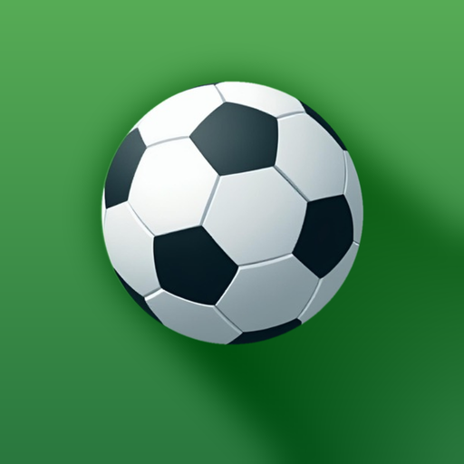
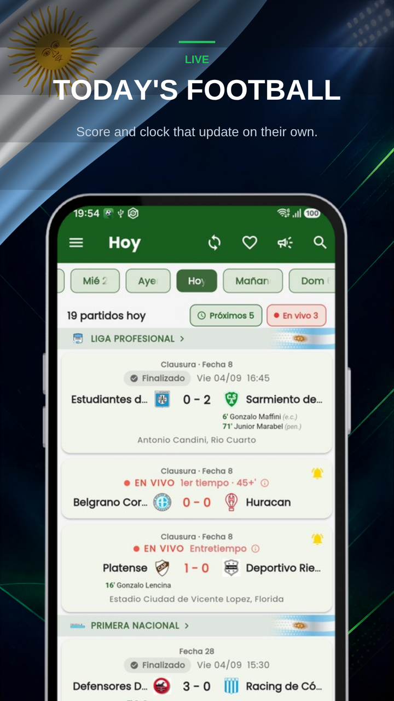
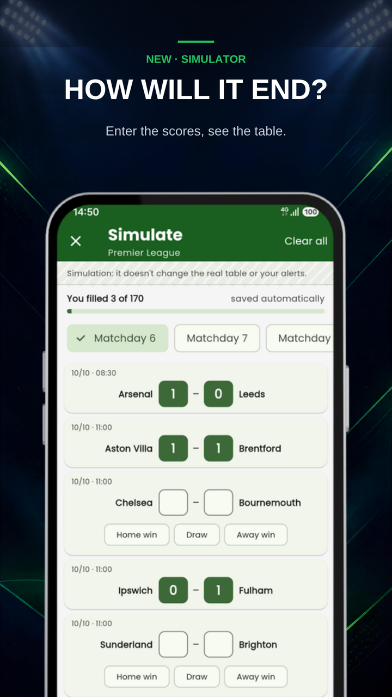
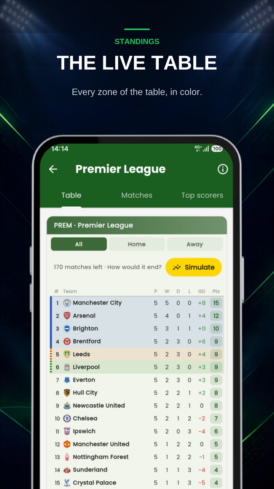
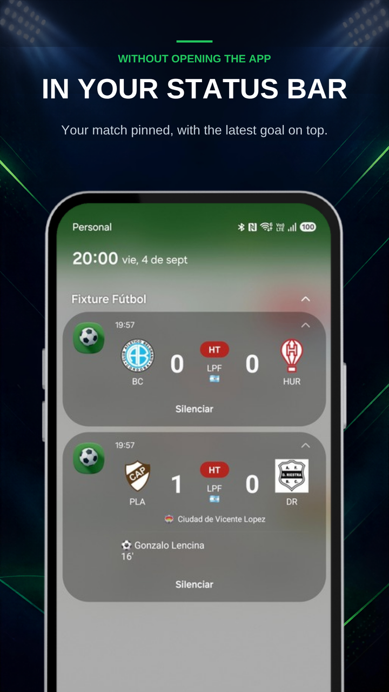
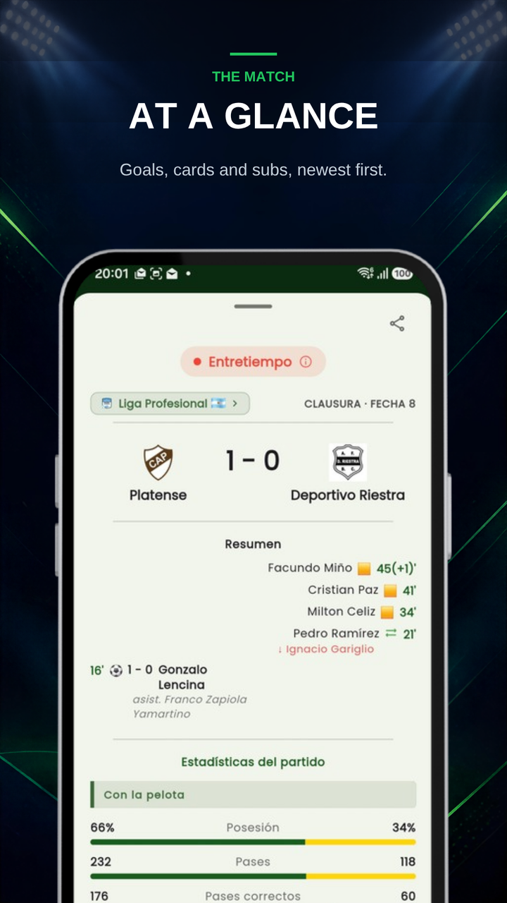
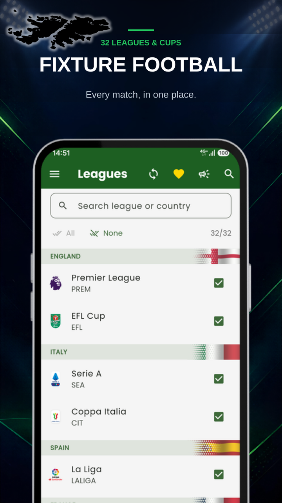

  
  <h1>Fixture كرة القدم: مباشر</h1>
  
<b>نتائج مباشرة وجداول ترتيب وأدوار إقصاء ومحاكاة. 32 بطولة، بدون إعلانات.</b>

  

 

  <a href="README.md">🇦🇷 Español</a> | <a href="README-en.md">🇺🇸 English</a> | <a href="README-pt.md">🇧🇷 Português</a> | <a href="README-it.md">🇮🇹 Italiano</a> | <a href="README-fr.md">🇫🇷 Français</a>
   
  <a href="README-de.md">🇩🇪 Deutsch</a> | <a href="README-nl.md">🇳🇱 Nederlands</a> | <a href="README-tr.md">🇹🇷 Türkçe</a> | <b>🇸🇦 العربية</b> | <a href="README-hi.md">🇮🇳 हिन्दी</a> | <a href="README-ja.md">🇯🇵 日本語</a> | <a href="README-ko.md">🇰🇷 한국어</a>

 

## كرة القدم لا تتوقف. والتطبيق كذلك.

Fixture لكرة القدم هو التطبيق الذي تتابع به الدوريات والكؤوس التي تهمك فعلاً، من هاتفك وبلا إعلانات. التطبيق متوفر بالإسبانية والإنجليزية والبرتغالية والإيطالية والفرنسية، وليس بالعربية بعد.

> ### 🐛 وجدت مشكلة أو لديك فكرة؟
> **[افتح تذكرة من هنا](../../issues/new/choose)** — نقرأها كلها.
> إذا ظهرت مباراة بشكل خاطئ، اذكر **إصدار التطبيق الذي لديك** و**أي مباراة كانت**: من دون هاتين المعلومتين يكاد يستحيل تكرار المشكلة.

---

### ⚽ 32 بطولة

الدوري الإنجليزي الممتاز، الليغا، الدوري الإيطالي، البوندسليغا، الدوري الفرنسي، وكذلك كأس إيطاليا وكأس الرابطة الإنجليزية. دوري أبطال أوروبا والدوري الأوروبي ودوري المؤتمر الأوروبي، بما في ذلك الأدوار التمهيدية. كوبا ليبرتادوريس وكوبا سودأمريكانا. الدوري البرازيلي وكأس البرازيل. MLS والدوري المكسيكي وكأس الدوريات ودوري أبطال الكونكاكاف. الدوري الأرجنتيني بدرجتيه وكأس الأرجنتين والسوبر الأرجنتيني والسوبر الدولي. إضافة إلى دوريات بيرو وكولومبيا وتشيلي والإكوادور والباراغواي وبوليفيا.

والبطولات المتوقفة بين المواسم تبقى محمَّلة وتظهر وحدها عندما تعود المباريات.

### 📊 مباشر بلا تحديث يدوي

النتيجة والدقيقة تتحدثان وحدهما. وأثناء مباراة فريقك تبقى المباراة مثبَّتة في شريط الإشعارات وآخر هدف في الأعلى.

### 🔮 جديد: محاكاة نهاية البطولة

أدخل نتائج المباريات المتبقية وشاهد كيف سيصبح جدول الترتيب، وفق معايير كسر التعادل في كل دوري. ومع النتائج الحقيقية تكتمل المحاكاة وحدها شيئًا فشيئًا، وتشاركها كصورة.

### 📈 جداول الترتيب وأدوار الإقصاء والهدافون

جدول كل دوري محدَّثًا، مع شريط ملوَّن يبيّن من يتأهل إلى كوبا ليبرتادوريس أو دوري الأبطال، ومن يصعد، ومن يخوض الأدوار الفاصلة، ومن يهبط. وفي الكؤوس أدوار الإقصاء: الذهاب والإياب والنتيجة الإجمالية ومن يتأهل. وقائمة الهدافين في معظم البطولات.

### 📱 الأداة المصغّرة على الشاشة الرئيسية

قبل المباراة: القناة وترتيب كل فريق. وأثناء اللعب تضيء وتُظهر الأهداف. وبعد النهاية: موقع الفريق في الجدول والمباراة التالية. وفي الأيام بلا مباريات: مباريات فرقك القادمة، مع أسهم وأعلام.

### 📺 أين تشاهدها

في كل مباراة ترى القناة التي تنقلها في بلدك: 17 دولة في الأمريكتين وإسبانيا والبرتغال. تختار بلدك من الإعدادات.

### 🔔 إشعارات تصل فعلاً

الأهداف وصفارة البداية والنهاية للمباريات التي تختارها. إشعار الهدف يذكر مسجّله وصاحب التمريرة الحاسمة، وإذا ألغاه حكم الفيديو نخبرك. ويمكنك الاكتفاء بالأهداف. حدّد فرقك المفضلة، أو فعّل الجرس على مباراة واحدة.

### 📋 المباراة بلمحة

الأهداف والبطاقات والتبديلات في قائمة واحدة، الأحدث في الأعلى؛ والحكم والملعب والطقس؛ وركلات الترجيح كما في التلفاز. وتشاركها مع المجموعة بلمستين.

### 🔍 سجل الموسم

التقويم يمتد من أربعة أيام مضت إلى أسبوعين قادمين؛ وفي تبويب السجل يوجد الموسم كاملاً لكل دوري، مع بحث بالفريق.

### 🎯 ما يخصك وحده

تؤشر على البطولات التي تهمك ولا يُنزَّل غيرها: بيانات أقل وبطارية أقل. بلا حساب ولا تسجيل: تفتح وتستخدم. ومباريات فرقك المفضلة تظهر دائمًا، تابعتَ ذلك الدوري أم لا.

### 🗂️ بطولة المنتخبات محفوظة

المباريات الـ104 التي أقيمت في يونيو ويوليو ما زالت داخل التطبيق: النتائج والمجموعات وجدول الأدوار والبطل.

---

## 💚 مجاني وبلا إعلانات، معًا

النتائج المباشرة وإشعارات فرقك وجداول الترتيب وأدوار الإقصاء والمحاكاة وسجل الموسم كلها مجانية. لا لافتة ولا مقطع مصور ولا أي شيء يحجب المباراة: لا إعلانات في Fixture ولن تكون. الخوادم والبيانات المباشرة ندفعها بيننا نحن مستخدميه: قهوة واحدة في الشهر تُبقي ما هو قائم وتتيح إضافة دوريات جديدة. يمكنك الإلغاء متى شئت من Google Play، وإن أردت يظهر اسمك على الجدار داخل التطبيق.

والانضمام إلينا يفتح أيضًا:

- التشكيلات على أرض الملعب: المس أي لاعب لترى عمره وطوله وقدمه المفضلة وجنسيته
- أفضل لاعب في المباراة
- بطاقة كل لاعب: التقييم والأهداف والتمريرات والالتحامات (في معظم البطولات)
- الإحصاءات التفصيلية: التسديدات على المرمى والتمريرات والركنيات والتصديات وغيرها
- إشعارات كل المباريات، لا مباريات فرقك فقط
- الأداة المصغّرة بكل فرقك، لا فريق واحد فقط
- حفظ أكثر من محاكاة، واحدة لكل بطولة

---

## لقطات الشاشة

لقطات الشاشة باللغة الإنجليزية: التطبيق غير متوفر بالعربية بعد.

  
  
  
  
    
  
  
  

---

## الأسئلة الشائعة

**أفتح التطبيق فأجده فارغًا / ما زلت أرى كأس العالم.**
لديك إصدار قديم. حدّث التطبيق من Google Play وستعود الدوريات والمباريات المباشرة والإشعارات.

**لا تصلني الإشعارات.**
تأكد من أن للتطبيق إذن الإشعارات وأن الفريق محدد بالجرس. في بعض الهواتف يجب استثناء التطبيق من توفير البطارية ليصل الإشعار والشاشة مطفأة.

**لا أرى القناة التي تنقل المباراة.**
اختر بلدك من الإعدادات. القنوات متاحة حاليًا في 17 دولة (الأمريكتان وإسبانيا والبرتغال)؛ إذا لم يكن بلدك منها، أخبرني في تذكرة.

**تنقص مباراة أو بطولة.**
أخبرني بها في [تذكرة](../../issues/new/choose). البطولات الـ32 أعلاه هي المتاحة اليوم، وتُضاف غيرها حسب الطلبات.

**هل البيانات رسمية؟**
تأتي من مزوّد بيانات رياضية. أحيانًا يتأخر تأكيد هدف أو اسم مسجله؛ وعندما يصحّح المزوّد، يصحّح التطبيق نفسه تلقائيًا.

---

## الخصوصية

التطبيق **لا يطلب حسابًا ولا تسجيلًا**. ما تختاره (الفرق المفضلة، الدوريات، الإشعارات) يُحفظ على هاتفك، لا على خادم. عملية شراء القهوة تتم عبر Google Play؛ نحن لا نرى بيانات بطاقتك ولا نحفظها.

---

  صُنع في الأرجنتين بواسطة <a href="https://egeainc.com">EgeaINC</a> · <a href="mailto:fixture@egeainc.com">fixture@egeainc.com</a>

