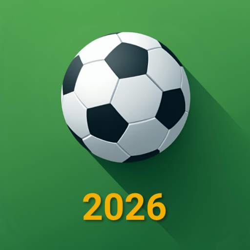
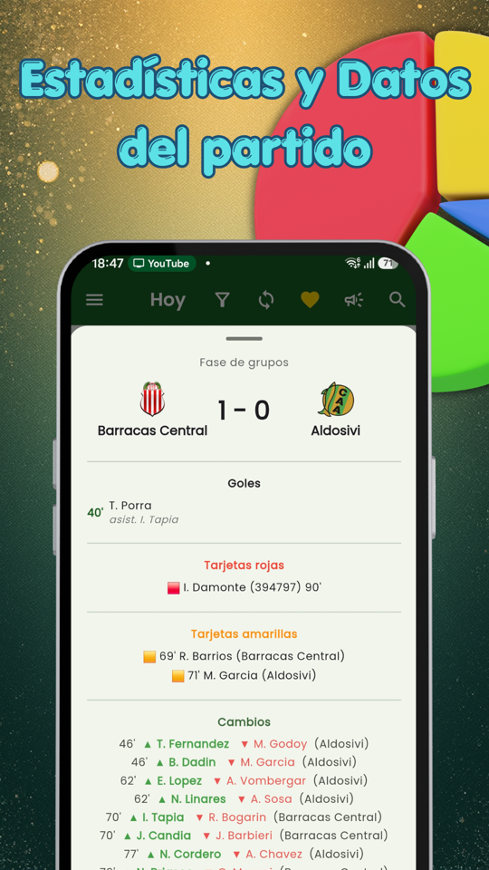
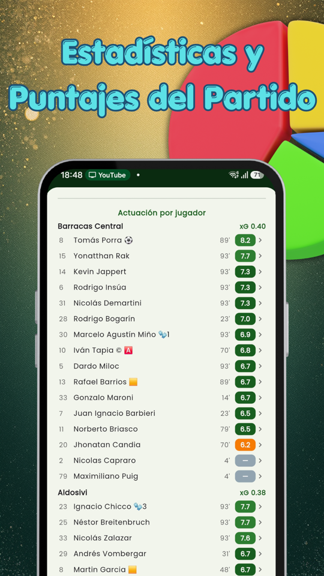
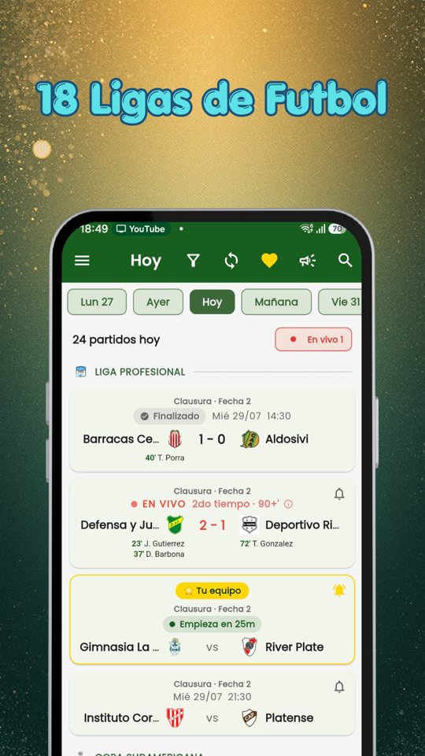
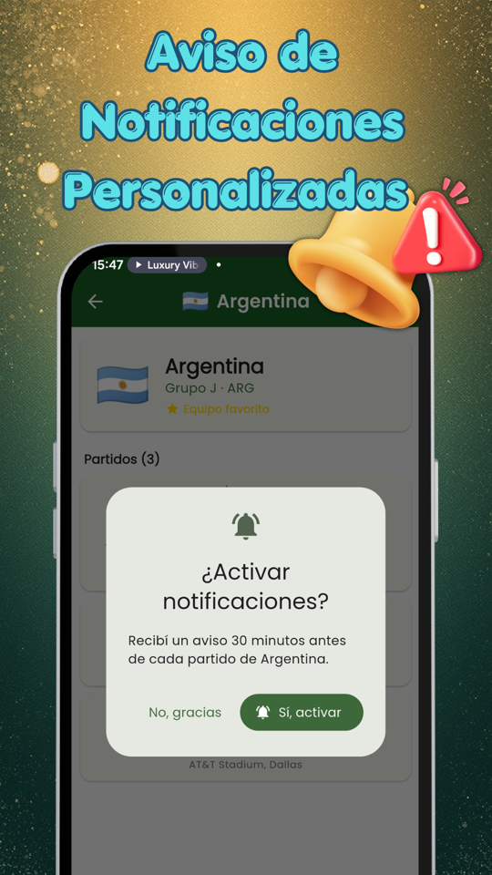
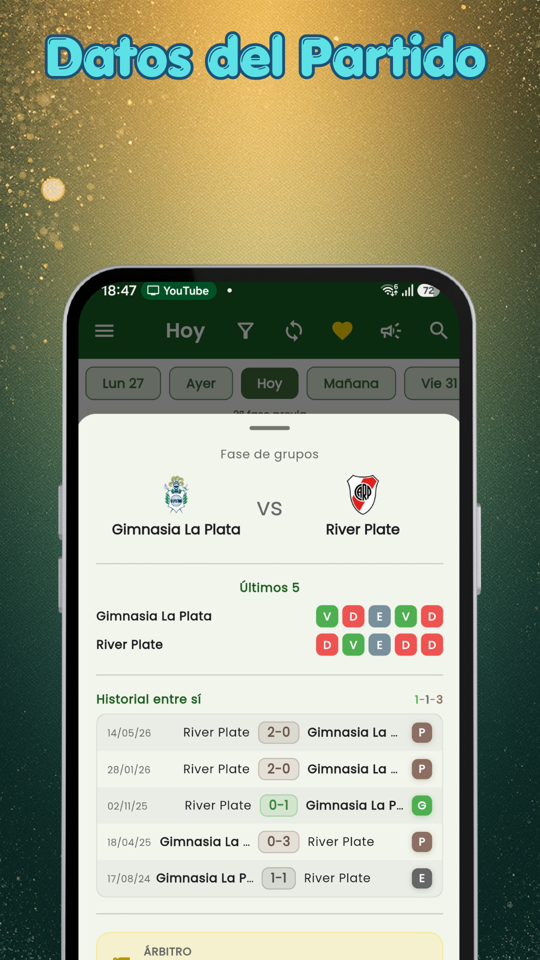
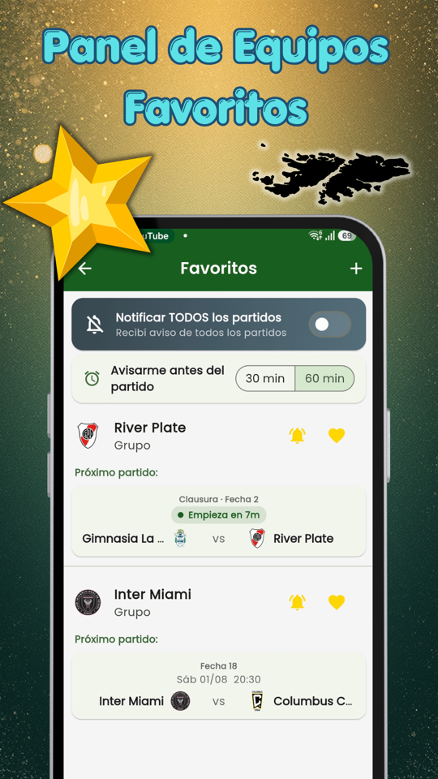
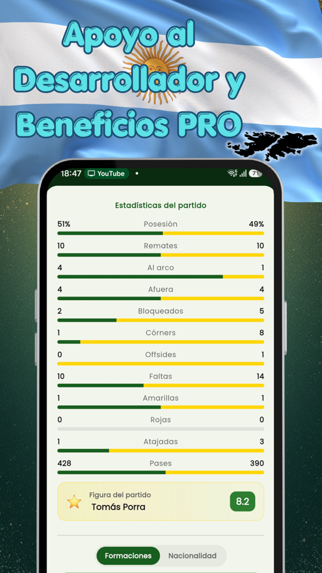
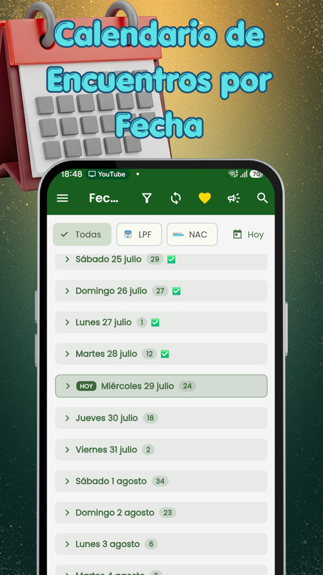

  
  <h1>Fixture Fútbol: Ligas En Vivo</h1>
  
<b>Resultados en vivo, formaciones, tablas y llaves. 16 ligas y copas, sin publicidad.</b>

  

 

  <b><a href="README.md">🇦🇷 Español</a> | 🇺🇸 English | <a href="README-pt.md">🇧🇷 Português</a>

 

> ### 🐛 Found a problem, or have an idea?
> **[Open a ticket here](../../issues/new/choose)** — every one gets read.
> If a match looks wrong, please say **which app version you have** and **which match it was**: without those two, it can almost never be reproduced.

---

## The World Cup is over. Football is not.

Fixture Fútbol follows the leagues and cups you care about, from your phone and with no ads. You pick your competitions and the app takes care of the rest.

### ⚽ 16 leagues and cups

**Argentina** — Liga Profesional, Primera Nacional, Copa Argentina
**South America** — Copa Libertadores, Copa Sudamericana
**Brazil** — Brasileirão Série A, Copa do Brasil
**Europe** — Champions League and Europa League (qualifying rounds included), Premier League, LaLiga, Serie A, Bundesliga, Ligue 1
**North America** — MLS, Liga MX

### 📊 Actually live

Score and minute in real time. While your team plays, the match stays **pinned to your notification bar**: you check it without opening the app.

### 🔔 Alerts that arrive

Goals, kick-off and full time for the matches you choose. Star your teams and find out without watching.

### 📋 What happened on the pitch

Line-ups with each shirt number, goals with scorer and minute, cards, substitutions, and player profiles with nationality.

### 🏆 Tables and brackets

Standings for every league, and knockout brackets that build themselves as ties are played.

---

## Screenshots

  
  
  
  
    
  
  
  
  

---

## How the app keeps going

Fixture was born to play with my family: a World Cup fixture so we could follow the matches together. It got out of hand, and when the World Cup ended I decided to keep going with the leagues.

**There are no ads here, and there will not be.** It is not a marketing stance: ads ruin the experience. You open the app for a score and have to dodge a banner.

The downside is that without ads the app does not pay for itself: servers and live data cost money every month. The only way this keeps going is together, with **a coffee a month** from inside the app. Alone it is little; among many, it is enough.

Thanks to everyone who already bought one. ⚽

---

## FAQ

**The app is empty / I still see the World Cup.**
You are on an old version. Update from Google Play and the leagues, live matches and notifications come back.

**Notifications do not arrive.**
Check that the app has notification permission and that the team has the bell on. On some phones you need to exclude the app from battery saving so it can alert with the screen off.

**A match or league is missing.**
Tell me which one in a [ticket](../../issues/new/choose). The 16 competitions above are the current ones; more get added based on what people ask for.

**Is the data official?**
It comes from a sports data provider. Sometimes it takes a while to confirm a goal or the scorer; when the provider corrects it, the app corrects itself.

---

## Privacy

The app **asks for no account and no sign-up**. What you choose (favourite teams, leagues, alerts) is stored on your phone, not on a server. The coffee purchase is handled by Google Play; we never see or store your card details.

---

  Made in Argentina by <a href="https://egeainc.com">EgeaINC</a> · <a href="mailto:fixture@egeainc.com">fixture@egeainc.com</a>

