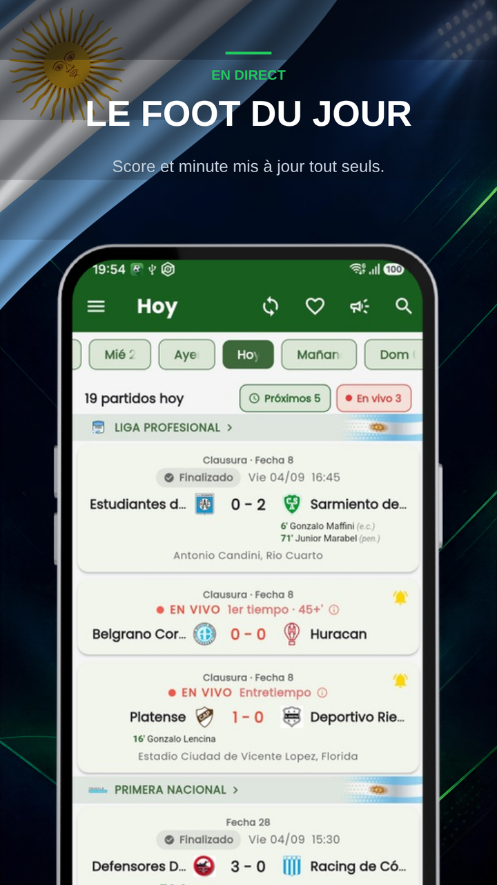
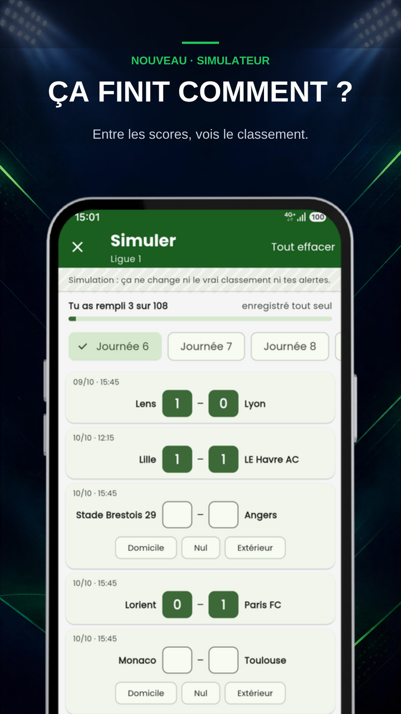
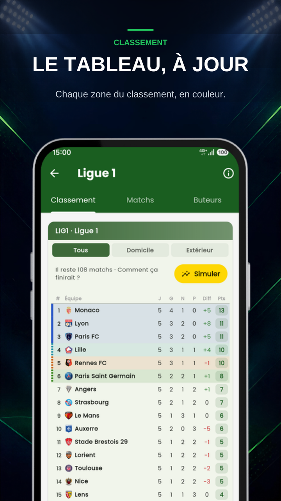
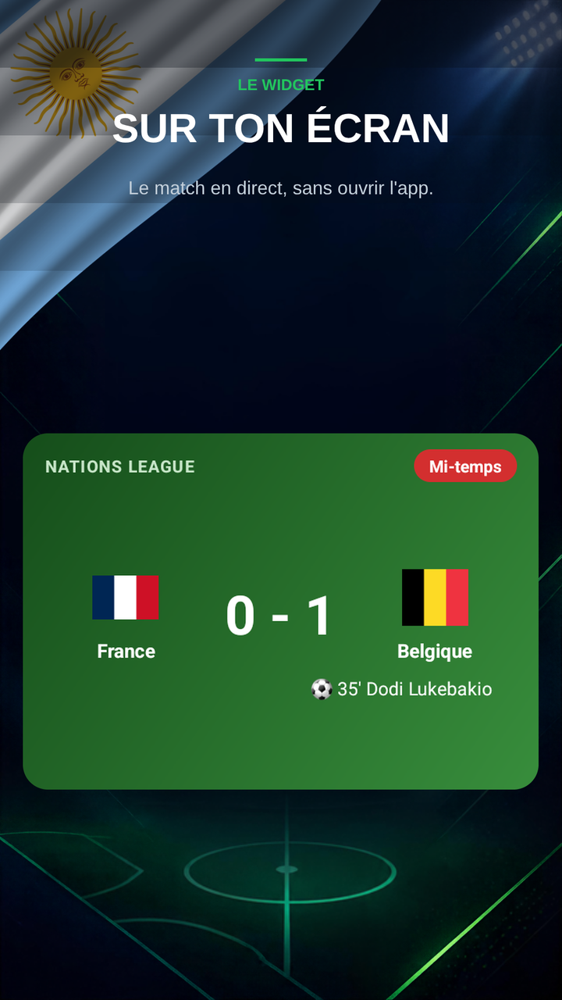
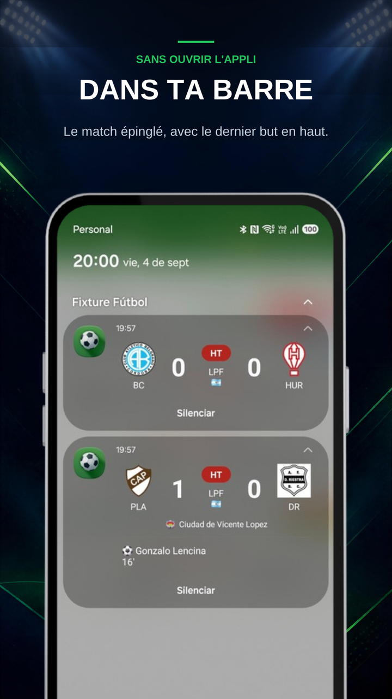
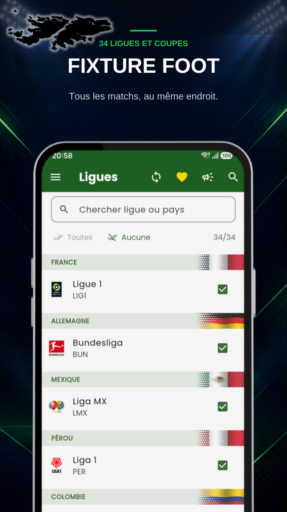
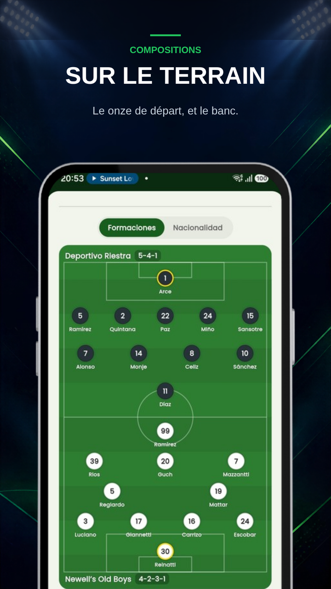

  
  <h1>Fixture Fútbol : Championnats En Direct</h1>
  
<b>Résultats en direct, compositions, classements et tableaux. 34 compétitions, tout gratuit.</b>

  

 

  <a href="README.md">🇦🇷 Español</a> | <a href="README-en.md">🇺🇸 English</a> | <a href="README-pt.md">🇧🇷 Português</a> | <a href="README-it.md">🇮🇹 Italiano</a> | <b>🇫🇷 Français</b>
   
  <a href="README-de.md">🇩🇪 Deutsch</a> | <a href="README-nl.md">🇳🇱 Nederlands</a> | <a href="README-tr.md">🇹🇷 Türkçe</a> | <a href="README-ar.md">🇸🇦 العربية</a> | <a href="README-hi.md">🇮🇳 हिन्दी</a> | <a href="README-ja.md">🇯🇵 日本語</a> | <a href="README-ko.md">🇰🇷 한국어</a>

 

> ### 🐛 Vous avez trouvé un problème ou vous avez une idée ?
> **[Ouvrez un ticket ici](../../issues/new/choose)** — ils sont tous lus.
> S'il s'agit d'un match mal affiché, indiquez **quelle version de l'appli vous avez** et **de quel match il s'agit** : sans ces deux informations, il est presque impossible de reproduire le problème.

---

## Le football ne s'arrête pas. L'appli non plus.

Fixture Fútbol est l'appli pour suivre les championnats et les coupes qui vous intéressent, depuis votre téléphone, gratuite et complète. Vous choisissez vos compétitions et l'appli ne télécharge que celles-là.

### ⚽ 34 compétitions

**Argentine** — Liga Profesional, Primera Nacional, Copa Argentina, Supercopa Argentina, Supercopa Internacional
**Amérique du Sud** — Copa Libertadores, Copa Sudamericana
**Brésil** — Brasileirão Série A, Copa do Brasil
**Europe** — Ligue des champions, Ligue Europa et Ligue Europa Conférence, avec leurs tours préliminaires · Premier League, LaLiga, Serie A, Bundesliga, Ligue 1 · Coppa Italia, EFL Cup
**Amérique du Nord** — MLS, Liga MX, Leagues Cup, Concacaf Champions
**Sélections** — Ligue des nations, matchs amicaux internationaux
**Reste de l'Amérique du Sud** — Pérou, Colombie, Chili, Équateur, Paraguay, Bolivie

Certaines sont hors saison : elles restent chargées et réapparaissent d'elles-mêmes dès que l'on rejoue.

### 📊 En direct, sans rafraîchir

Score et minute qui se mettent à jour tout seuls. Pendant que votre équipe joue, le match reste **épinglé dans la barre de notifications** avec le dernier but en haut : vous le suivez sans ouvrir l'appli. Vous touchez la carte et vous arrivez directement sur le match.

### 🔮 Nouveau : simulez comment ça finit

Entrez les résultats manquants et voyez comment finirait le classement, avec les critères de départage de chaque championnat. Votre simulation se complète seule avec les vrais résultats, et vous la partagez en image. Et dans les coupes, choisissez qui passe à chaque tour, jusqu'au champion.

### 📱 Le widget sur l'écran d'accueil

Avant le match, la chaîne et le rang de chaque équipe. En direct, il s'allume et affiche les buts. À la fin, le classement et le prochain match. Les jours sans match, les prochains matchs de vos équipes, avec flèches et drapeaux. Vous l'ajoutez depuis le menu de l'appli, avec toutes vos équipes, pas seulement une.

### 🔔 Des alertes qui arrivent

But, coup d'envoi et fin des matchs que vous choisissez. L'alerte de but indique qui l'a marqué et qui a donné la passe décisive. Et si la VAR l'annule, on vous prévient que ce but n'existe plus.

Vous choisissez lesquelles vous voulez : vous pouvez ne demander que les buts, et rien d'autre. Vous marquez vos équipes favorites, vous activez la cloche sur un match isolé, ou vous demandez les alertes de tous les matchs.

### 📋 Le match en un coup d'œil

Buts, cartons et remplacements dans une seule liste, le plus récent en haut, et chaque période se termine en rappelant le score à cet instant. Sous le match : l'arbitre, le stade, la date et la météo. S'il y a des tirs au but, la séance s'affiche comme à la télé : qui a tiré, qui a marqué et qui a manqué. Et vous la partagez au groupe en deux touches.

### 👕 Compositions sur le terrain

Les onze placés sur le terrain et les remplaçants sur le banc. Touchez un joueur et vous avez son âge, sa taille, son pied et sa nationalité.

### ⭐ L'homme du match et les statistiques

L'homme du match et, dans la plupart des compétitions, la fiche de chaque joueur : note, buts, passes et tacles. Et les statistiques détaillées : tirs cadrés, passes, corners, arrêts et plus.

### 📈 Classements

Chaque classement à jour, avec un code couleur pour la Ligue des champions, la Libertadores, la montée, les play-offs ou la relégation. Et les buteurs dans la plupart des compétitions.

### 🏆 Tableaux des coupes

Aller, retour, score cumulé et qui se qualifie. Sans calcul. Touchez une rencontre et tout le tableau s'ouvre, et il se complète seul avec les équipes déjà qualifiées.

### 📅 Journées et historique

Le calendrier va de quatre jours en arrière à quatre jours en avant. Et dans Aujourd'hui, en balayant vers l'arrière au-delà du jour le plus ancien, il y a l'Historique : la saison complète de chaque championnat, avec une recherche par équipe.

### 📺 Où regarder chaque match

Choisissez votre pays dans les Réglages et chaque match vous indique sur quelle chaîne il est diffusé. Cela fonctionne déjà dans 17 pays.

### 🎯 Seulement ce qui est à vous

Vous cochez les compétitions qui vous intéressent et le reste n'est pas téléchargé : moins de données, moins de batterie et un écran sans bruit. Sans compte ni inscription : vous ouvrez et ça marche. Et les matchs de vos équipes favorites apparaissent toujours, que vous suiviez ce championnat ou non.

### 🗂️ Le tournoi des sélections, conservé

Les 104 matchs joués en juin et juillet sont restés dans l'appli : résultats, groupes, tableaux et le champion. Gratuitement, pour y revenir quand vous voulez.

### 🌐 Langues

L'appli est en français, en espagnol, en anglais, en portugais et en italien, au choix dans les Réglages.

---

## Captures d'écran

  
  
  
  
    
  
  
  
  

---

## Comment l'appli tient debout

Fixture est née pour jouer en famille : un calendrier de la Coupe du monde pour suivre les matchs entre nous. Ça a pris de l'ampleur, et quand la Coupe du monde s'est terminée, j'ai décidé de continuer avec les championnats.

Pour la faire vivre et la faire grandir, depuis la 1.9.124, on compte sur **des publicités qui ne gênent pas** : quelques-unes entre les matchs et dans les classements de chaque compétition, et une dans la fiche du match, toujours signalées comme publicité. Elles ne cachent jamais le match et ne s'ouvrent jamais en plein écran. Les serveurs et les données en direct coûtent de l'argent chaque mois, et c'est ainsi qu'ils continuent de tourner.

Si vous préférez ne pas les voir, **avec PRO — un café par mois — vous ne voyez aucune publicité**, votre nom apparaît sur le mur de celles et ceux qui soutiennent le projet et vous gardez une simulation par compétition. Résiliable à tout moment sur Google Play.

Merci à celles et ceux qui nous ont déjà rejoints. ⚽

---

## Questions fréquentes

**J'ouvre l'appli et elle est vide / je vois encore la Coupe du monde.**
Vous êtes resté sur une ancienne version. Mettez à jour depuis Google Play et les championnats, les matchs en direct et les notifications reviennent.

**Je ne reçois pas les notifications.**
Vérifiez que l'appli a l'autorisation de notifications et que l'équipe est marquée avec la cloche. Sur certains téléphones, il faut sortir l'appli de l'économiseur de batterie pour qu'elle prévienne écran éteint.

**Je ne vois pas sur quelle chaîne passe le match.**
Choisissez votre pays dans les Réglages. Les chaînes couvrent 17 pays pour l'instant ; si le vôtre n'y est pas, dites-le-moi dans un ticket.

**Il manque un match / un championnat.**
Dites-moi lequel dans un [ticket](../../issues/new/choose). Les 34 compétitions ci-dessus sont celles disponibles aujourd'hui ; d'autres s'ajoutent selon les demandes.

**Les données sont-elles officielles ?**
Elles viennent d'un fournisseur de données sportives. Il met parfois du temps à confirmer un but ou le nom du buteur ; quand le fournisseur corrige, l'appli se corrige toute seule.

---

## Confidentialité

L'appli **ne demande ni compte ni inscription**. Ce que vous choisissez (équipes favorites, championnats, alertes) est enregistré sur votre téléphone, pas sur un serveur. L'achat du café est géré par Google Play ; nous ne voyons ni ne conservons les données de votre carte. Les publicités sont fournies par Google AdMob, qui peut utiliser l'identifiant publicitaire de votre téléphone pour les choisir ; en Europe et au Royaume-Uni, l'appli vous demande d'abord votre consentement. Avec PRO, aucune publicité n'est demandée.

---

  Fait en Argentine par <a href="https://egeainc.com">EgeaINC</a> · <a href="mailto:fixture@egeainc.com">fixture@egeainc.com</a>

