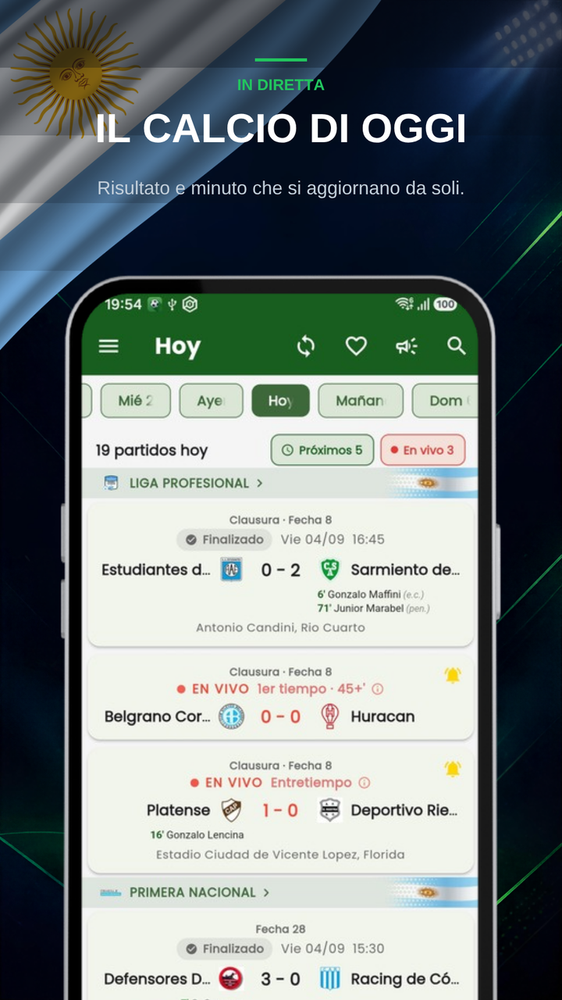
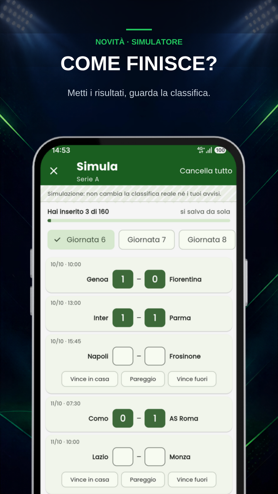
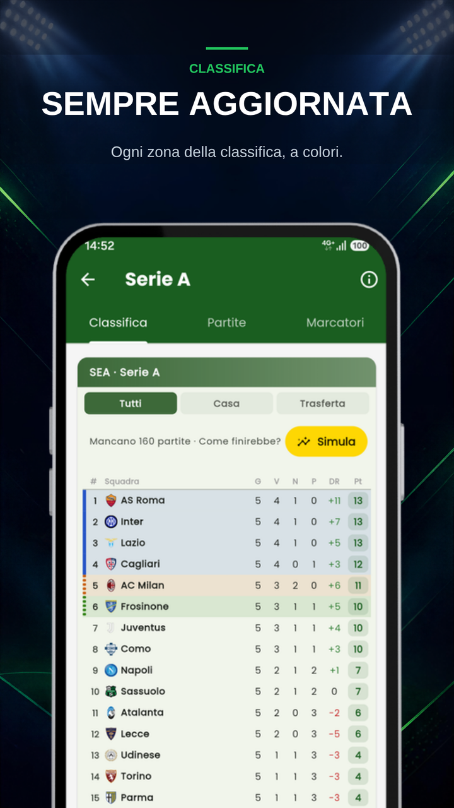
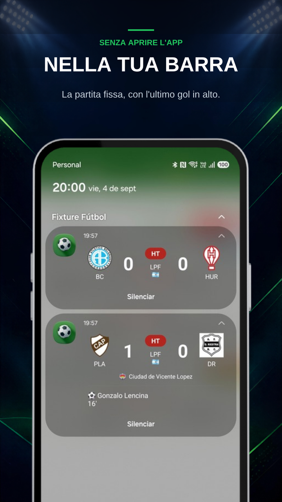
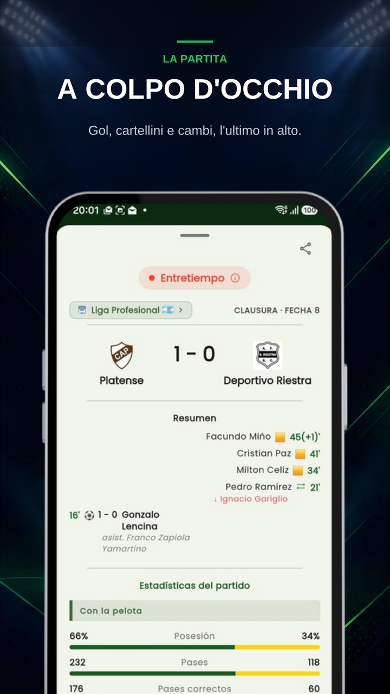
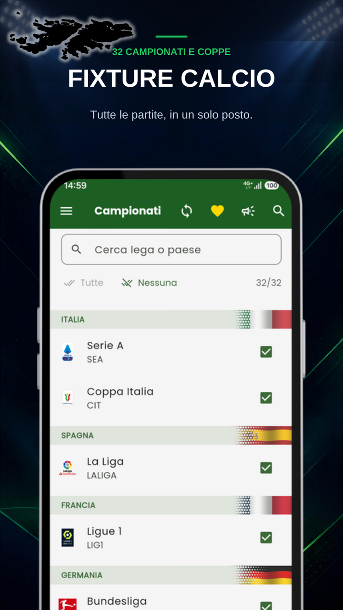
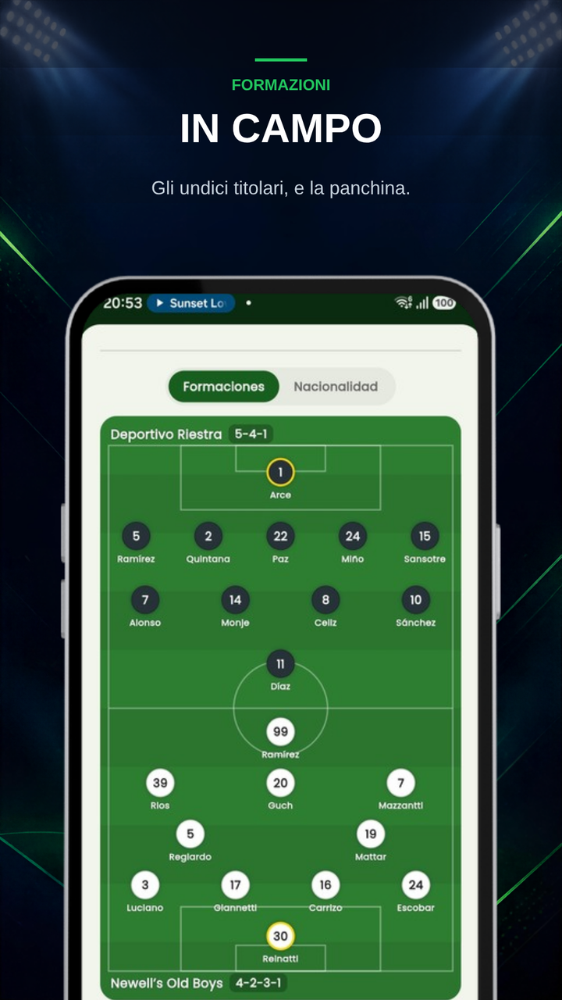

  
  <h1>Fixture Fútbol: Campionati In Diretta</h1>
  
<b>Risultati in diretta, formazioni, classifiche e tabelloni. 34 competizioni, senza pubblicità.</b>

  

 

  <a href="README.md">🇦🇷 Español</a> | <a href="README-en.md">🇺🇸 English</a> | <a href="README-pt.md">🇧🇷 Português</a> | <b>🇮🇹 Italiano</b> | <a href="README-fr.md">🇫🇷 Français</a>
   
  <a href="README-de.md">🇩🇪 Deutsch</a> | <a href="README-nl.md">🇳🇱 Nederlands</a> | <a href="README-tr.md">🇹🇷 Türkçe</a> | <a href="README-ar.md">🇸🇦 العربية</a> | <a href="README-hi.md">🇮🇳 हिन्दी</a> | <a href="README-ja.md">🇯🇵 日本語</a> | <a href="README-ko.md">🇰🇷 한국어</a>

 

> ### 🐛 Hai trovato un problema o hai un'idea?
> **[Apri una segnalazione qui](../../issues/new/choose)** — vengono lette tutte.
> Se è una partita che si vede male, scrivi **quale versione dell'app hai** e **di quale partita si tratta**: senza questi due dati quasi mai si riesce a riprodurre il problema.

---

## Il calcio non si ferma. L'app nemmeno.

Fixture Fútbol è l'app per seguire i campionati e le coppe che ti interessano, dal telefono e senza pubblicità. Scegli le tue competizioni e l'app scarica solo quelle.

### ⚽ 34 competizioni

**Argentina** — Liga Profesional, Primera Nacional, Copa Argentina, Supercopa Argentina, Supercopa Internacional
**Sudamerica** — Copa Libertadores, Copa Sudamericana
**Brasile** — Brasileirão Série A, Copa do Brasil
**Europa** — Champions League, Europa League e Conference League, con i loro turni preliminari · Premier League, LaLiga, Serie A, Bundesliga, Ligue 1 · Coppa Italia, EFL Cup
**Nordamerica** — MLS, Liga MX, Leagues Cup, Concacaf Champions
**Nazionali** — Nations League, amichevoli tra nazionali
**Resto del Sudamerica** — Perù, Colombia, Cile, Ecuador, Paraguay, Bolivia

Alcune sono fuori stagione: restano caricate e ricompaiono da sole quando si torna a giocare.

### 📊 In diretta, senza aggiornare

Risultato e minuto che si aggiornano da soli. Mentre gioca la tua squadra, la partita resta **fissa nella barra delle notifiche** con l'ultimo gol in cima: la guardi senza aprire l'app. Tocchi la scheda ed entri dritto nella partita.

### 🔮 Novità: simula come finisce

Inserisci i risultati mancanti e guarda come finirebbe la classifica, con i criteri di parità di ogni campionato. Si completa da sola con i risultati veri e la condividi come immagine.

### 📱 Il widget nella schermata Home

Prima della partita, il canale e la posizione di ogni squadra. In diretta si accende e mostra i gol. A fine partita, la classifica aggiornata e il prossimo impegno. Nei giorni senza partite, i prossimi impegni delle tue squadre, con frecce e bandiere. Lo aggiungi dal menu dell'app.

### 🔔 Avvisi che arrivano

Gol, inizio e fine delle partite che scegli. L'avviso del gol dice chi l'ha segnato e chi ha servito l'assist. E se il VAR lo annulla, ti avvisiamo che quel gol non c'è più.

Scegli quali vuoi: puoi chiedere solo i gol e nient'altro. Segni le tue squadre del cuore, oppure metti la campanella su una singola partita.

### 📋 La partita a colpo d'occhio

Gol, cartellini e sostituzioni in un unico elenco, con l'ultimo in cima, e ogni tempo si chiude dicendo com'era il risultato. Sotto la partita: l'arbitro, lo stadio, il giorno e il meteo. Se si va ai rigori, la serie si vede come in TV: chi ha tirato, chi ha segnato e chi ha sbagliato. E la condividi nel gruppo in due tocchi.

### 👕 Formazioni in campo

Gli undici schierati sul campo e le riserve in panchina. Tocca un giocatore e trovi età, altezza, piede e nazionalità.

### 📈 Classifiche

Ogni classifica aggiornata, con una fascia colorata per Champions, Libertadores, promozione, playoff e retrocessione. E i marcatori nella maggior parte delle competizioni.

### 🏆 Tabelloni delle coppe

Andata, ritorno, risultato complessivo e chi passa. Senza fare conti. Tocca un incrocio e si apre il tabellone intero, che si completa da solo con chi è già passato.

### 📅 Giornate e storico

Il calendario va da quattro giorni indietro a quattro in avanti. E in Oggi, scorrendo indietro oltre il giorno più vecchio, c'è lo Storico: la stagione completa di ogni campionato, con la ricerca per squadra.

### 📺 Dove vedere ogni partita

Scegli il tuo Paese nelle Impostazioni e ogni partita ti mostra su quale canale la trasmettono. Funziona già in 17 Paesi.

### 🎯 Solo ciò che è tuo

Spunti le competizioni che ti interessano e il resto non viene scaricato: meno dati, meno batteria e lo schermo senza rumore. Senza account né registrazione: apri e funziona. E le partite delle tue squadre del cuore compaiono sempre, che tu segua quel campionato o no.

### 🗂️ Il torneo per nazionali, conservato

Le 104 partite giocate a giugno e luglio sono rimaste dentro l'app: risultati, gironi, tabelloni e il campione. Gratis, per tornarci quando vuoi.

### 🌐 Lingue

L'app è in italiano, spagnolo, inglese, portoghese e francese, e si sceglie nelle Impostazioni.

---

## Schermate

  
  
  
  
    
  
  
  

---

## Come si sostiene l'app

Fixture è nata per giocare in famiglia: un calendario del Mondiale per seguire le partite tra di noi. È sfuggita di mano e, quando il Mondiale è finito, ho deciso di andare avanti con i campionati.

**Qui non c'è pubblicità, e non ci sarà.** Non è una posa di marketing: rovina l'esperienza. Apri per vedere un risultato e devi schivare un banner.

Il rovescio della medaglia è che senza pubblicità l'app non si paga da sola: i server e i dati in diretta costano ogni mese. L'unico modo perché questo continui è farlo insieme, con **un caffè al mese** dall'app stessa. Da solo è poco; in tanti, basta.

I risultati in diretta, gli avvisi delle tue squadre, le classifiche, i tabelloni, il simulatore e lo storico sono **gratis e lo resteranno**. Il caffè aggiunge le formazioni disegnate in campo, il migliore in campo, la scheda di ogni giocatore, le statistiche di dettaglio, gli avvisi di tutte le partite, il widget con tutte le tue squadre e una simulazione salvata per ogni competizione. E, se vuoi, il tuo nome compare sul muro, dentro l'app.

Grazie a chi ne ha già offerto uno. ⚽

---

## Domande frequenti

**Apro l'app ed è vuota / vedo ancora il Mondiale.**
Hai una versione vecchia. Aggiorna da Google Play e tornano i campionati, le partite in diretta e le notifiche.

**Le notifiche non mi arrivano.**
Controlla che l'app abbia il permesso per le notifiche e che la squadra sia segnata con la campanella. Su alcuni telefoni bisogna togliere l'app dal risparmio energetico perché avvisi a schermo spento.

**Non vedo su che canale danno la partita.**
Scegli il tuo Paese nelle Impostazioni. I canali coprono 17 Paesi per ora; se il tuo non c'è, scrivimelo in una segnalazione.

**Manca una partita / un campionato.**
Dimmi quale in una [segnalazione](../../issues/new/choose). Le 34 competizioni qui sopra sono quelle disponibili oggi; se ne aggiungono altre in base a ciò che chiedete.

**I dati sono ufficiali?**
Arrivano da un fornitore di dati sportivi. A volte ci mette un po' a confermare un gol o il nome del marcatore; quando il fornitore corregge, l'app si corregge da sola.

---

## Privacy

L'app **non chiede account né registrazione**. Quello che scegli (squadre del cuore, campionati, avvisi) resta salvato sul tuo telefono, non su un server. L'acquisto del caffè lo gestisce Google Play; noi non vediamo né conserviamo i dati della tua carta.

---

  Fatto in Argentina da <a href="https://egeainc.com">EgeaINC</a> · <a href="mailto:fixture@egeainc.com">fixture@egeainc.com</a>

