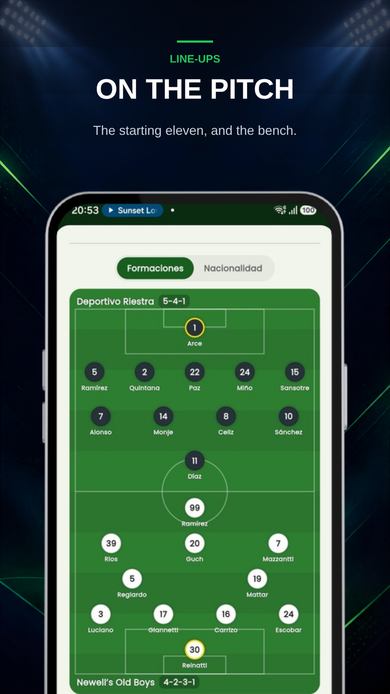

  
  <h1>Fixture サッカー ライブ</h1>
  
<b>ライブスコア、順位表、トーナメント、シミュレーター。34の大会、すべて無料。</b>

  

 

  <a href="README.md">🇦🇷 Español</a> | <a href="README-en.md">🇺🇸 English</a> | <a href="README-pt.md">🇧🇷 Português</a> | <a href="README-it.md">🇮🇹 Italiano</a> | <a href="README-fr.md">🇫🇷 Français</a>
   
  <a href="README-de.md">🇩🇪 Deutsch</a> | <a href="README-nl.md">🇳🇱 Nederlands</a> | <a href="README-tr.md">🇹🇷 Türkçe</a> | <a href="README-ar.md">🇸🇦 العربية</a> | <a href="README-hi.md">🇮🇳 हिन्दी</a> | <b>🇯🇵 日本語</b> | <a href="README-ko.md">🇰🇷 한국어</a>

 

## サッカーは止まりません。このアプリも止まりません。

Fixture サッカーは、あなたが本当に気になるリーグとカップだけを追いかけるアプリです。スマホから、無料で、すべての機能を。アプリはスペイン語・英語・ポルトガル語・イタリア語・フランス語に対応しています（日本語には未対応）。

> ### 🐛 不具合を見つけた、またはアイデアがありますか？
> **[こちらからチケットを作成](../../issues/new/choose)** — すべて目を通しています。
> 試合の表示がおかしい場合は、**お使いのアプリのバージョン**と**どの試合か**を書いてください。この2つがないと、ほとんど再現できません。

---

### ⚽ 34の大会

プレミアリーグ、ラ・リーガ、セリエA、ブンデスリーガ、リーグ・アン、さらにコッパ・イタリアとEFLカップ。チャンピオンズリーグ、ヨーロッパリーグ、カンファレンスリーグ（それぞれ予選を含む）。コパ・リベルタドーレスとコパ・スダメリカーナ。ブラジル全国選手権とコパ・ド・ブラジル。MLS、リーガMX、リーグズカップ、コンカカフ・チャンピオンズ。ネーションズリーグと代表チームの親善試合。アルゼンチンのリーグ・プロフェシオナル、プリメーラ・ナシオナル、コパ・アルヘンティーナ、スーペルコパ・アルヘンティーナ、スーペルコパ・インテルナシオナル。さらにペルー、コロンビア、チリ、エクアドル、パラグアイ、ボリビアのリーグ。

シーズンオフの大会も読み込まれたままで、再開すると自動的に表示されます。

### 📊 更新操作なしのライブ

スコアと経過時間はひとりでに更新されます。応援するチームの試合中は、最新のゴールを上にして通知バーに固定表示。

### 🔮 新機能: 最終順位をシミュレーション

残り試合の結果を入れると、順位表がどうなるかがわかります。各リーグの順位決定ルールどおりに計算。実際の結果が出るたびに自動で反映され、画像にしてシェアできます。 カップ戦では、各対戦の勝ち上がりを選んで優勝チームまで予想できます。

### 📈 順位表、トーナメント表、得点ランキング

各リーグの順位表を最新の状態で。リベルタドーレス、チャンピオンズリーグ、昇格、プレーオフ、降格の圏内を色の帯で示します。カップ戦はトーナメント表で、ホームとアウェイ、2試合合計、勝ち上がるチームまで。ほとんどの大会で得点ランキングも見られます。

### 📱 ホーム画面のウィジェット

試合前は、放送チャンネルと両チームの順位。試合中は光ってゴールを知らせます。試合後は順位表での位置と次の試合。試合のない日は、応援するチームの次の試合を矢印と国旗つきで表示します。 ひとつだけでなく、お気に入りのチームすべてを表示できます。

### 📺 どこで見られるか

各試合を、あなたの国でどのチャンネルが放送するか。南北アメリカ、スペイン、ポルトガルの17か国に対応。国は設定から選べます。

### 🔔 ちゃんと届く通知

選んだ試合のゴール、キックオフ、試合終了。ゴール通知は得点者とアシストした選手を伝え、VARで取り消されたときもお知らせします。ゴールだけ受け取ることもできます。お気に入りのチームに印をつける、気になる試合ひとつにベルを立てる、またはすべての試合の通知を受け取ることもできます。

### 📋 試合をひと目で

ゴール、カード、交代をひとつのリストに、新しい順で。ピッチ上のフォーメーション: 選手をタップすると年齢、身長、利き足、国籍がわかります。マン・オブ・ザ・マッチと、ほとんどの大会では各選手のスタッツ（評価、ゴール、パス、タックル）。さらに詳細なスタッツ: 枠内シュート、パス、CK、セーブなど。主審、スタジアム、天気、そしてテレビと同じようなPK戦の表示。二回のタップでグループに共有できます。

### 🔍 シーズンの記録

カレンダーは4日前から2週間先まで。「履歴」タブには各リーグのシーズン全体があり、チーム名で検索できます。

### 🎯 あなたのものだけ

気になる大会にチェックを入れれば、それ以外は読み込まれません。通信量もバッテリーも減ります。アカウント登録は不要。開けばすぐ使えます。お気に入りチームの試合は、そのリーグを選んでいなくても必ず表示されます。

### 🗂️ 代表チームの大会も保存

6月と7月の104試合は今もアプリの中に。結果、グループ、トーナメント表、そして優勝チーム。

---

## 💚 PROなら広告なし

アプリはじゃまにならない広告で運営しています。広告は試合リストのあいだ、順位表、試合画面に表示され、試合を隠したり、全画面で開いたりすることはありません。月にコーヒー1杯のPROなら広告は一切表示されず、プロジェクトを支える人のウォールに名前が載り、大会ごとに1つずつシミュレーションを保存できます。解約はGoogle Playからいつでも。

---

## スクリーンショット

スクリーンショットは英語です。アプリはまだ日本語に対応していません。

  
  
  
  
    
  
  
  
  

---

## よくある質問

**アプリを開くと空っぽ／まだワールドカップが表示される。**
古いバージョンのままです。Google Play からアップデートすると、リーグ、ライブの試合、通知が戻ります。

**通知が届かない。**
アプリに通知の許可があるか、チームにベルのマークが付いているかを確認してください。機種によっては、画面オフでも通知を受け取るためにアプリを省電力の対象から外す必要があります。

**試合を放送するチャンネルが表示されない。**
設定で国を選んでください。チャンネル情報は現在17か国（南北アメリカ、スペイン、ポルトガル）に対応しています。お住まいの国がない場合はチケットで教えてください。

**試合やリーグが足りない。**
どれかを[チケット](../../issues/new/choose)で教えてください。上の34大会が現在の対応分で、要望に応じて追加しています。

**データは公式ですか？**
スポーツデータの提供会社から届いています。ゴールや得点者の名前の確定に時間がかかることがありますが、提供会社が訂正するとアプリも自動で訂正されます。

---

## プライバシー

アプリは**アカウントも登録も不要**です。選んだ内容（お気に入りのチーム、リーグ、通知）はサーバーではなくお使いのスマートフォンに保存されます。コーヒーの購入は Google Play が処理し、カード情報を私たちが見たり保存したりすることはありません。 広告は Google AdMob が配信し、広告の選択にスマートフォンの広告IDを使うことがあります。ヨーロッパとイギリスでは、アプリが事前に同意を求めます。PROでは広告のリクエスト自体を行いません。

---

  アルゼンチンで <a href="https://egeainc.com">EgeaINC</a> が制作 · <a href="mailto:fixture@egeainc.com">fixture@egeainc.com</a>

