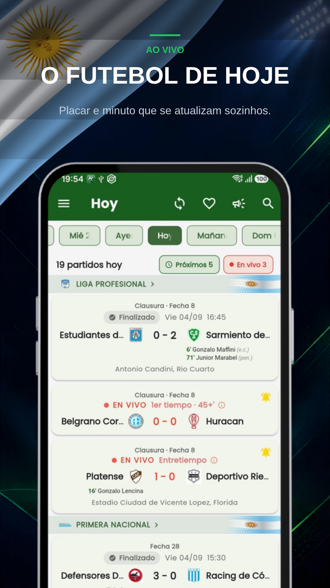
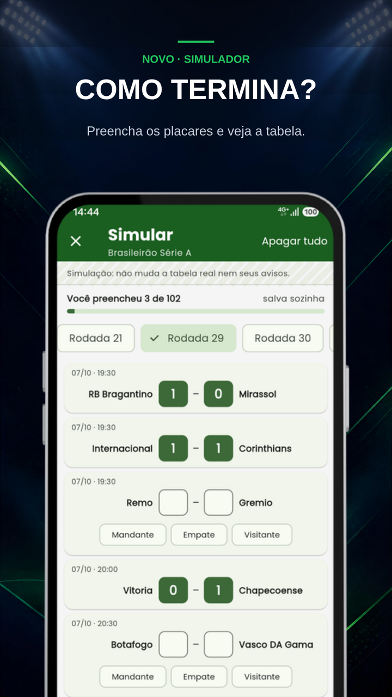
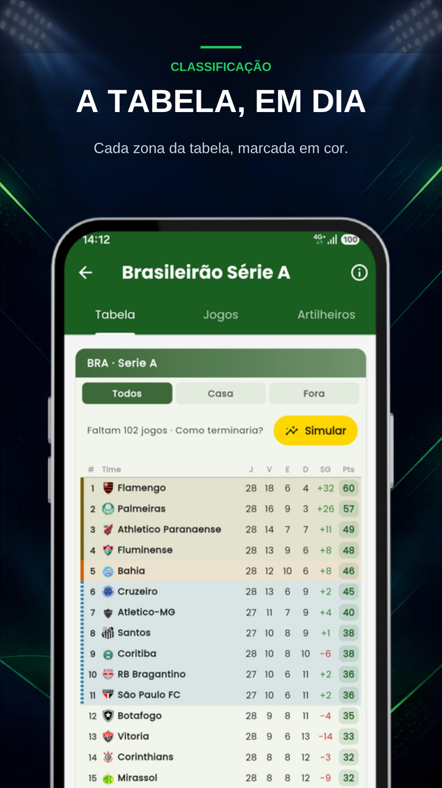
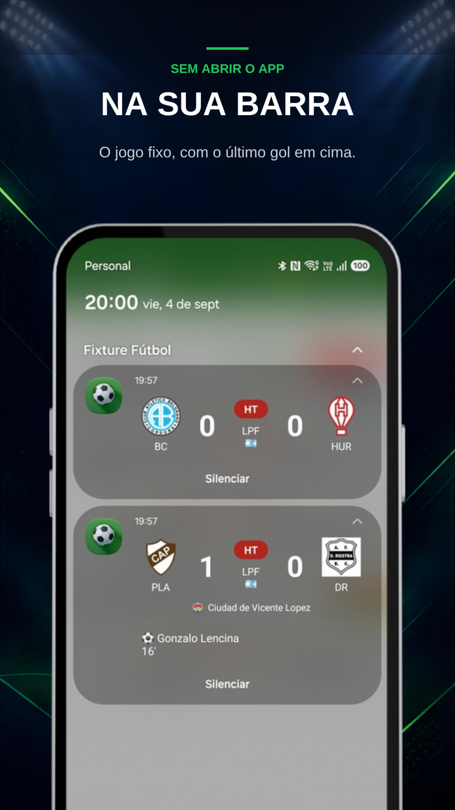
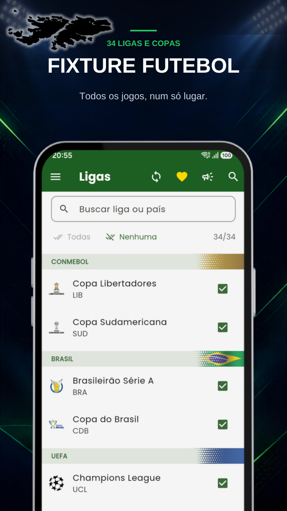

  
  <h1>Fixture Fútbol: Ligas Ao Vivo</h1>
  
<b>Resultados ao vivo, escalações, tabelas e chaves. 34 competições, sem anúncios.</b>

  

 

  <a href="README.md">🇦🇷 Español</a> | <a href="README-en.md">🇺🇸 English</a> | <b>🇧🇷 Português</b> | <a href="README-it.md">🇮🇹 Italiano</a> | <a href="README-fr.md">🇫🇷 Français</a>
   
  <a href="README-de.md">🇩🇪 Deutsch</a> | <a href="README-nl.md">🇳🇱 Nederlands</a> | <a href="README-tr.md">🇹🇷 Türkçe</a> | <a href="README-ar.md">🇸🇦 العربية</a> | <a href="README-hi.md">🇮🇳 हिन्दी</a> | <a href="README-ja.md">🇯🇵 日本語</a> | <a href="README-ko.md">🇰🇷 한국어</a>

 

> ### 🐛 Achou um problema ou teve uma ideia?
> **[Abra um ticket aqui](../../issues/new/choose)** — todos são lidos.
> Se for um jogo que aparece errado, conte **qual versão do app você tem** e **qual era o jogo**: sem esses dois dados quase nunca dá para reproduzir.

---

## O futebol não para. O app também não.

Fixture Fútbol é o app para acompanhar as ligas e copas que importam para você, pelo celular e sem anúncios. Você escolhe suas competições e o app baixa só essas.

### ⚽ 34 competições

**Argentina** — Liga Profesional, Primera Nacional, Copa Argentina, Supercopa Argentina, Supercopa Internacional
**América do Sul** — Copa Libertadores, Copa Sudamericana
**Brasil** — Brasileirão Série A, Copa do Brasil
**Europa** — Champions League, Europa League e Conference League, com suas fases preliminares · Premier League, LaLiga, Serie A, Bundesliga, Ligue 1 · Coppa Italia, EFL Cup
**América do Norte** — MLS, Liga MX, Leagues Cup, Concacaf Champions
**Seleções** — Nations League, amistosos de seleções
**Resto da América do Sul** — Peru, Colômbia, Chile, Equador, Paraguai, Bolívia

Algumas estão fora de temporada: ficam carregadas e aparecem sozinhas quando voltam a jogar.

### 📊 Ao vivo, sem atualizar

Placar e minuto que se atualizam sozinhos. Enquanto seu time joga, a partida fica **fixa na barra de notificações** com o último gol em cima: você olha sem abrir o app. Toca no cartão e entra direto no jogo.

### 🔮 Novo: simule como termina

Preencha os resultados que faltam e veja como ficaria a tabela, com os critérios de desempate de cada liga. A simulação vai se completando sozinha com os resultados reais, e você compartilha como imagem.

### 📱 O widget na tela inicial

Antes do jogo, o canal e a posição de cada time. Ao vivo, ele acende e mostra os gols. No fim, como ficou a tabela e o próximo jogo. Nos dias sem jogo, os próximos jogos dos seus times, com setas e bandeiras. Você adiciona pelo menu do app.

### 🔔 Avisos que chegam

Gol, início e fim das partidas que você escolher. O aviso de gol diz quem fez e quem deu a assistência. E se o VAR anular, avisamos que aquele gol não existe mais.

Você escolhe quais quer: pode pedir só os gols e nada mais. Marca seus times favoritos ou põe o sininho em um jogo avulso.

### 📋 A partida, num relance

Gols, cartões e substituições em uma lista só, com o mais recente em cima, e cada tempo fecha dizendo como estava o placar. Abaixo da partida: o árbitro, o estádio, o dia e o clima. Se houver pênaltis, a disputa aparece como na TV: quem bateu, quem fez e quem errou. E você compartilha no grupo em dois toques.

### 👕 Escalações no campo

Os onze postados em campo e os reservas no banco. Toque em um jogador e ali estão a idade, a altura, o pé e a nacionalidade.

### 📈 Tabelas de classificação

A tabela de cada liga sempre atualizada, com uma faixa colorida que mostra quem vai para a Libertadores, para a Champions, quem sobe, quem vai para os playoffs e quem cai. E a artilharia na maioria das competições.

### 🏆 Chaves das copas

Ida, volta, resultado agregado e quem passa. Sem fazer conta. Toque em um confronto e o chaveamento inteiro se abre, e ele se completa sozinho com quem já passou.

### 📅 Rodadas e histórico

O calendário vai de quatro dias atrás a quatro à frente. E em Hoje, deslizando para trás até passar o dia mais antigo, está o Histórico: a temporada completa de cada liga, com busca por time.

### 📺 Onde assistir a cada jogo

Escolha seu país em Ajustes e cada partida mostra por qual canal ela passa. Já funciona em 17 países.

### 🎯 Só o que é seu

Você marca as competições que importam e o resto não é baixado: menos dados, menos bateria e a tela sem ruído. Sem conta nem cadastro: abre e usa. E os jogos dos seus times favoritos aparecem sempre, siga você aquela liga ou não.

### 🗂️ O torneio de seleções, guardado

Os 104 jogos disputados em junho e julho continuam dentro do app: resultados, grupos, chaves e o campeão. De graça, para voltar quando quiser.

### 🌐 Idiomas

O app está em português, espanhol, inglês, italiano e francês, e se escolhe em Ajustes.

---

## Capturas de tela

  
  
  
  
    
  
  
  

---

## Como o app se sustenta

O Fixture nasceu para jogar em família: um fixture da Copa para acompanharmos os jogos entre nós. Saiu do controle e, quando a Copa terminou, decidi seguir com as ligas.

**Aqui não há anúncios, e não vai haver.** Não é postura de marketing: eles arruínam a experiência. Você abre para ver um resultado e tem que desviar de um banner.

O contra é que sem anúncios o app não se paga sozinho: os servidores e os dados ao vivo custam dinheiro todo mês. A única forma de isso continuar é entre todos, com **um café por mês** dentro do próprio app. Sozinho é pouco; entre muitos, dá.

Os resultados ao vivo, os avisos dos seus times, as tabelas, as chaves, o simulador e o histórico são **gratuitos e vão continuar sendo**. O café acrescenta as escalações desenhadas em campo, o craque da partida, a ficha de cada jogador, as estatísticas detalhadas, os avisos de todas as partidas, o widget com todos os seus times e uma simulação salva por competição. E, se quiser, seu nome aparece no mural, dentro do app.

Obrigado a quem já pagou um. ⚽

---

## Perguntas frequentes

**Abro o app e está vazio / ainda vejo a Copa.**
Você ficou com uma versão antiga. Atualize pela Google Play e voltam as ligas, os jogos ao vivo e as notificações.

**As notificações não chegam.**
Confira se o app tem permissão de notificações e se o time está marcado com o sininho. Em alguns celulares é preciso tirar o app da economia de bateria para que ele avise com a tela apagada.

**Não vejo por qual canal passa o jogo.**
Escolha seu país em Ajustes. Os canais cobrem 17 países por enquanto; se o seu não estiver, me conte em um ticket.

**Falta um jogo / uma liga.**
Conte qual em um [ticket](../../issues/new/choose). As 34 competições acima são as que existem hoje; vão sendo somadas conforme o que pedirem.

**Os dados são oficiais?**
Vêm de um provedor de dados esportivos. Às vezes ele demora a confirmar um gol ou o nome do goleador; quando o provedor corrige, o app corrige sozinho.

---

## Privacidade

O app **não pede conta nem cadastro**. O que você escolhe (times favoritos, ligas, avisos) fica guardado no seu celular, não em um servidor. A compra do café é feita pela Google Play; nós não vemos nem guardamos dados do seu cartão.

---

  Feito na Argentina por <a href="https://egeainc.com">EgeaINC</a> · <a href="mailto:fixture@egeainc.com">fixture@egeainc.com</a>

